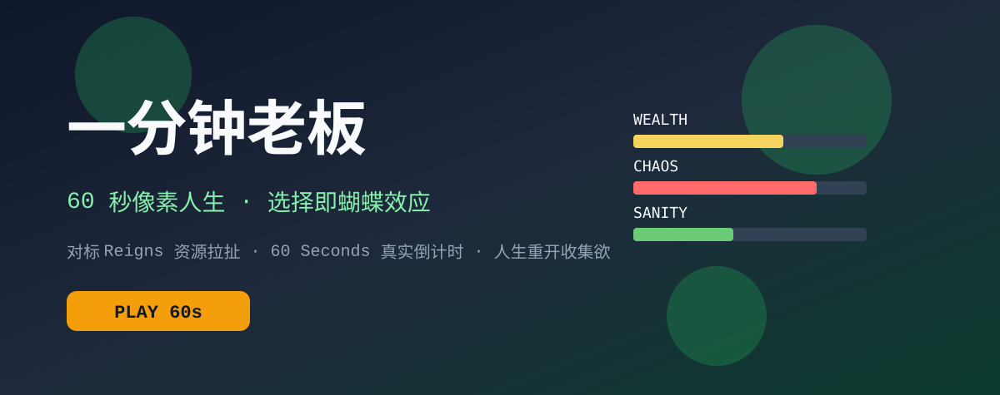

<div align="center">

</div>

# One Min CEO

一分钟老板是一个 60 秒像素人生互动游戏。玩家会被随机投放到富豪、CEO、冠军、太空旅客等荒诞身份里，通过选择和自由输入触发蝴蝶效应结局。

项目已经改造成可直接部署到 GitHub Pages 的静态 Vite 应用。AI 生成能力通过 SiliconFlow OpenAI-compatible Chat Completions API 提供，默认模型为 `Qwen/Qwen2.5-14B-Instruct`。

## 本地运行

**环境要求：** Node.js 22 或更高版本

1. 安装依赖：

   ```bash
   npm install
   ```

2. 创建 `.env.local` 并配置 SiliconFlow 密钥：

   ```bash
   VITE_SILICONFLOW_API_KEY="你的 SiliconFlow API Key"
   VITE_SILICONFLOW_MODEL="Qwen/Qwen2.5-14B-Instruct"
   ```

3. 启动开发服务器：

   ```bash
   npm run dev
   ```

4. 类型检查和构建：

   ```bash
   npm run lint
   npm run build
   ```

## GitHub Pages 发布

项目内置 GitHub Actions 工作流：`.github/workflows/pages.yml`。

1. 在仓库 Settings -> Pages 中将 Source 设置为 `GitHub Actions`。
2. 在仓库 Settings -> Secrets and variables -> Actions 中新增 secret：

   ```text
   SILICONFLOW_API_KEY
   ```

3. 推送到 `main`，或手动运行 “发布 GitHub Pages” 工作流。
4. 默认访问地址：

   ```text
   https://unknownparticles.github.io/one_min_ceo/
   ```

## 密钥说明

GitHub Actions 会在构建时把 `SILICONFLOW_API_KEY` 写入 `public/runtime-config.js`，避免密钥进入 git 提交历史。

但 GitHub Pages 是纯静态托管，浏览器运行时必须能读取这个配置文件，所以该密钥仍会对页面访问者可见。建议只使用短期、低额度、受限范围的临时密钥；长期生产密钥应放在后端代理服务中调用。

## API 配置

当前默认配置：

```text
Endpoint: https://api.siliconflow.cn/v1/chat/completions
Model: Qwen/Qwen2.5-14B-Instruct
Authorization: Bearer <SILICONFLOW_API_KEY>
```


## 玩法钩子优化（2026-07）

针对“不好玩”的核心问题做了短局体验改造：

- **真实软倒计时**：对话中时间仍以 0.4x 流逝，恢复 `60 Seconds!` 式压迫感。
- **四维资源条**：资产 / 声望 / 理智 / 荒诞，对标 `Reigns` 的平衡崩溃乐趣。
- **连击与命运罗盘**：连续决策累积连击；一键跳到下一未完成节点，减少地图空跑。
- **极端结算**：资源触顶/触底会提前爆出荒诞结局，强化“再来一局”。
- **资源 SVG 化**：Logo / Banner / 关注二维码改为 SVG，加载更清晰。
